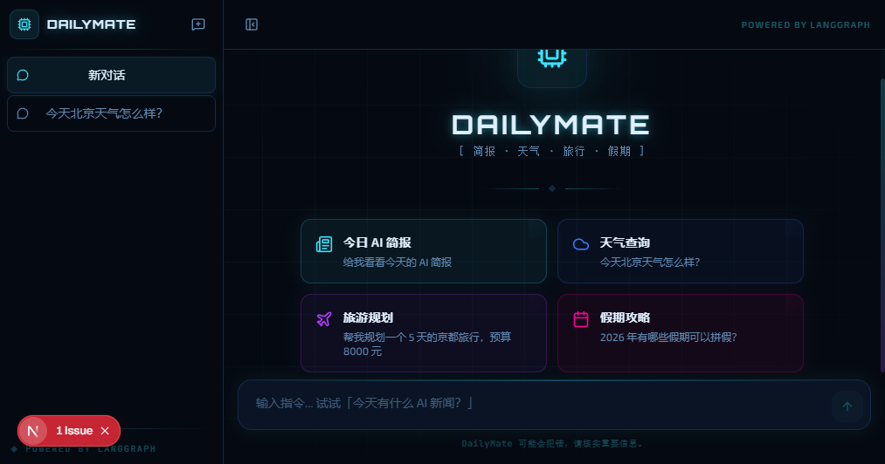
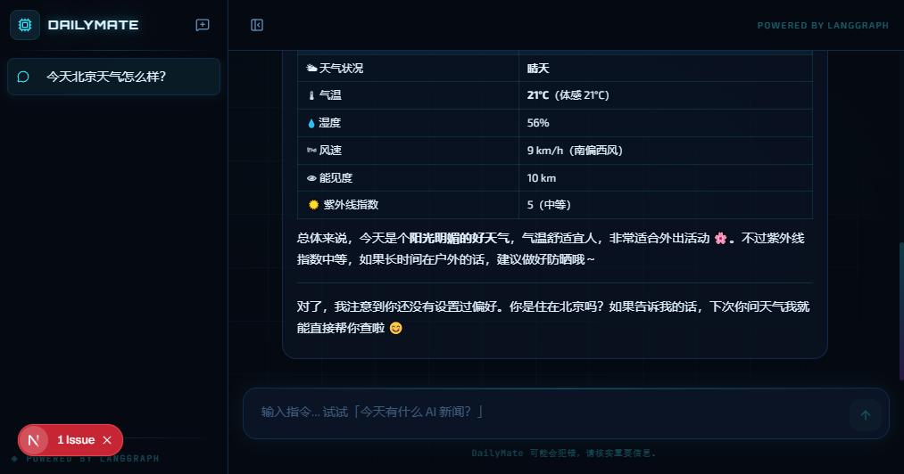

# 🤖 DailyMate

**你的 AI 驱动个人超级助手** — 每日简报 · 天气查询 · 旅游规划 · 假期攻略

基于 LangGraph + Next.js 构建，支持任何 OpenAI 兼容模型（GPT-4o、Claude、DeepSeek、Ollama 本地模型等）。

<p align="center">
  
  &nbsp;
  
</p>

---

## ✨ 功能亮点

| 功能 | 说明 |
|------|------|
| 📰 **每日简报** | 聚合 Hacker News、JavaScript Weekly、CSS-Tricks、MIT Tech Review 等 RSS 源，LLM 摘要生成结构化简报 |
| 🌤️ **天气查询** | 全球任意城市实时天气（wttr.in，免费无需 Key） |
| ✈️ **旅游规划** | 根据目的地、天数、预算、兴趣生成详细行程方案 |
| 📅 **假期规划** | 查询 100+ 国家法定假日，中国含调休安排，提供拼假攻略 |
| 🔍 **网页搜索** | DuckDuckGo 搜索，无需 API Key |
| 🧠 **偏好记忆** | 自动记住你的常住城市、兴趣标签、旅行风格 |
| 💬 **流式对话** | Web UI 支持实时流式输出 + Markdown 渲染 |
| 🃏 **富卡片展示** | 天气卡片、简报列表、假期日历、旅行概览等可视化组件 |

## 🏗️ 技术架构

```
┌─────────────────────────────────┐
│     Next.js Web UI              │
│   React 19 + Tailwind CSS 4    │
│   Vercel AI SDK (流式)          │
└──────────────┬──────────────────┘
               │ POST /api/chat
┌──────────────▼──────────────────┐
│     LangGraph ReAct Agent       │
│   推理 → 工具调用 → 循环        │
├─────────────────────────────────┤
│  🌤️ weather    📰 briefing      │
│  🔍 search     📅 holidays      │
│  ✈️ travel     🧠 preferences   │
└──────────────┬──────────────────┘
               │
┌──────────────▼──────────────────┐
│  LLM (OpenAI 兼容 API)         │
│  GPT-4o / Claude / DeepSeek    │
│  Ollama / 任何兼容网关          │
└─────────────────────────────────┘
```

## 🚀 快速开始

### 前置要求

- **Node.js** >= 20
- 一个 OpenAI 兼容的 API Key（或本地 Ollama）

### 1. 克隆 & 安装

```bash
git clone https://github.com/kawayiKobe/dailymate.git
cd dailymate
npm install
```

### 2. 配置环境变量

```bash
cp .env.example .env
```

编辑 `.env`，填写你的 API 配置：

```env
# OpenAI
OPENAI_BASE_URL=https://api.openai.com/v1
OPENAI_API_KEY=sk-your-key-here
OPENAI_MODEL=gpt-4o

# 或者使用 Ollama 本地模型（完全免费）
# OPENAI_BASE_URL=http://localhost:11434/v1
# OPENAI_API_KEY=ollama
# OPENAI_MODEL=qwen2.5:14b
```

<details>
<summary>更多模型配置示例</summary>

**DeepSeek**
```env
OPENAI_BASE_URL=https://api.deepseek.com/v1
OPENAI_API_KEY=sk-...
OPENAI_MODEL=deepseek-chat
```

**月之暗面 (Moonshot)**
```env
OPENAI_BASE_URL=https://api.moonshot.cn/v1
OPENAI_API_KEY=sk-...
OPENAI_MODEL=moonshot-v1-8k
```

**Azure OpenAI**
```env
OPENAI_BASE_URL=https://<resource>.openai.azure.com/openai/deployments/<model>/
OPENAI_API_KEY=your-azure-key
OPENAI_MODEL=gpt-4o
```

</details>

### 3. 启动

```bash
# Web UI（推荐）
npm run dev
# 访问 http://localhost:3000

# 或 CLI 模式
npm run chat
```

## 🐳 Docker 部署

```bash
# 构建并运行
docker compose up -d

# 或手动构建
docker build -t dailymate .
docker run -p 3000:3000 --env-file .env dailymate
```

## 📁 项目结构

```
dailymate/
├── app/                          # Next.js App Router
│   ├── api/chat/route.ts         #   流式对话 API
│   ├── layout.tsx                #   全局布局
│   ├── page.tsx                  #   主页（对话界面）
│   └── globals.css               #   全局样式 + 主题
├── components/                   # React 组件
│   ├── cards/                    #   富卡片组件
│   │   ├── weather-card.tsx      #     天气卡片
│   │   ├── briefing-card.tsx     #     简报卡片
│   │   ├── holiday-card.tsx      #     假期卡片
│   │   ├── travel-card.tsx       #     旅游卡片
│   │   └── tool-status.tsx       #     工具调用状态
│   ├── chat-message.tsx          #   消息气泡
│   ├── chat-input.tsx            #   输入栏
│   └── welcome-screen.tsx        #   欢迎页
├── src/
│   ├── model.ts                  # LLM 配置（OpenAI 兼容）
│   ├── cli.ts                    # CLI 交互入口
│   └── lib/
│       ├── agent.ts              #   LangGraph Agent 核心
│       └── tools/                #   工具集
│           ├── weather.ts        #     天气（wttr.in）
│           ├── web-search.ts     #     搜索（DuckDuckGo）
│           ├── daily-briefing.ts #     简报（RSS 聚合）
│           ├── holiday.ts        #     假期（nager.at + 中国）
│           ├── travel-planner.ts #     旅游规划
│           └── user-preferences.ts #   用户偏好存储
├── demos/                        # LangChain 学习示例
├── .env.example                  # 环境变量模板
├── Dockerfile                    # Docker 构建
├── docker-compose.yml            # Docker Compose
└── LICENSE                       # MIT
```

## 🛠️ 核心技术栈

| 层面 | 技术 |
|------|------|
| Agent 框架 | [LangGraph.js](https://github.com/langchain-ai/langgraphjs) — ReAct 模式多步推理 |
| LLM 接口 | [@langchain/openai](https://js.langchain.com/docs/integrations/chat/openai) — OpenAI 兼容 |
| Web 框架 | [Next.js 16](https://nextjs.org) App Router + Turbopack |
| 流式传输 | [Vercel AI SDK](https://sdk.vercel.ai) + @ai-sdk/langchain 适配器 |
| UI | [Tailwind CSS 4](https://tailwindcss.com) + [Lucide Icons](https://lucide.dev) |
| Markdown | [react-markdown](https://github.com/remarkjs/react-markdown) + remark-gfm |
| RSS | [rss-parser](https://github.com/rbren/rss-parser) |
| 爬虫 | [cheerio](https://cheerio.js.org) |

## 🧩 添加自定义工具

在 `src/lib/tools/` 下创建新文件：

```typescript
import { tool } from "@langchain/core/tools";
import { z } from "zod";

export const myTool = tool(
  async ({ param }) => {
    // 你的工具逻辑
    return JSON.stringify({ result: "..." });
  },
  {
    name: "my_tool",
    description: "工具描述，LLM 会根据此描述决定何时调用",
    schema: z.object({
      param: z.string().describe("参数说明"),
    }),
  },
);
```

然后在 `src/lib/tools/index.ts` 中导出，并在 `src/lib/agent.ts` 的 `tools` 数组中注册即可。

## 📚 学习资源

`demos/` 目录包含 LangChain.js 各功能的独立示例：

```bash
npm run demo:basic        # 基础对话
npm run demo:weather      # 工具调用（手写 Agent 循环）
npm run demo:buffer       # BufferMemory 记忆
npm run demo:summary      # 摘要记忆
npm run demo:session      # 多会话记忆
npm run demo:embeddings   # 文本嵌入
npm run demo:vectorstore  # 向量检索 RAG
```

## 🤝 贡献

欢迎 PR 和 Issue！可以贡献的方向：

- 🌐 多语言支持（英文 / 日文等）
- 📊 更多数据源（GitHub Trending、Product Hunt 等）
- 🗄️ 持久化存储（Redis / PostgreSQL 替代 MemorySaver）
- 🎨 主题定制（亮色模式、自定义色彩）
- 📱 移动端适配优化
- 🔌 更多工具（邮件、日历、笔记等）

## 📄 License

[MIT](./LICENSE)
